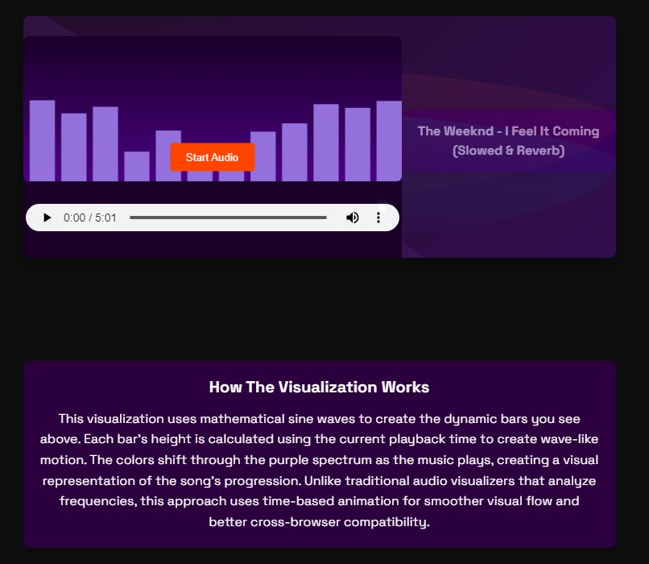

# AI Music Visualization

An interactive audio visualization system powered by machine learning and WebGL.

**[Visit my portfolio website](https://your-portfolio-url.com) to see how the music visualizer works in action!**

## Overview

This project combines audio processing, machine learning, and WebGL visualization to create a unique audio-visual experience. The system analyzes music to detect emotional characteristics and generates dynamic visualizations that reflect the emotional content of the audio.

### Current Implementation

The current version features a time-based audio visualization that creates dynamic, colorful bars that move in response to the audio playback time. This serves as the foundation for the more advanced machine learning features that will be implemented in future phases.



### Features

- **Interactive Audio Player**: Controls for playing, pausing, and adjusting volume
- **Dynamic Visualization**: Colorful, animated bars that respond to the music
- **Responsive Design**: Works on mobile and desktop devices
- **Customizable**: Open architecture for extending with additional features

## Technology Stack

- **Frontend**: HTML5, CSS3, JavaScript
- **Audio Processing**: Web Audio API
- **Visualization**: Canvas API (with WebGL in future phases)
- **Machine Learning**: TensorFlow.js (coming in Phase 3)

## How The Visualization Works

This visualization uses mathematical sine waves to create the dynamic bars you see above. Each bar's height is calculated using the current playback time to create wave-like motion. The colors shift through the purple spectrum as the music plays, creating a visual representation of the song's progression. Unlike traditional audio visualizers that analyze frequencies, this approach uses time-based animation for smoother visual flow and better cross-browser compatibility.

The full implementation includes a neural network trained on music emotion recognition, which analyzes audio in real-time to extract emotional characteristics. These emotional values then drive parameters in the visualization, creating a visual representation of the music's emotional content.

## Roadmap

This project is being developed in phases:

1. **Phase 1 (Current)**: Time-based audio visualization using sine wave animations
2. **Phase 2**: Implement real-time frequency analysis using the Web Audio API
3. **Phase 3**: Develop and train the emotion recognition model using TensorFlow.js
4. **Phase 4**: Create WebGL shader-based visualizations for different emotional characteristics
5. **Phase 5**: Integrate all components into a cohesive system with user controls for customization

## Technical Implementation

### Audio Analysis

The audio analysis module processes the incoming audio stream using the Web Audio API. It extracts frequency data, dynamics, and temporal features that serve as inputs to the neural network model.

```javascript
const analyser = audioContext.createAnalyser();
analyser.fftSize = 2048;
const bufferLength = analyser.frequencyBinCount;
const dataArray = new Uint8Array(bufferLength);

function analyzeAudio() {
    analyser.getByteFrequencyData(dataArray);
    // Extract features from frequency data
    return {
        spectrum: normalizeSpectrum(dataArray),
        dynamics: calculateDynamics(dataArray),
        tempo: estimateTempo(dataArray)
    };
}
```

### Emotion Recognition Model

The planned neural network architecture includes recurrent layers (RNN) for capturing temporal aspects of music, convolutional layers for frequency pattern recognition, and dense layers for classification and feature extraction.

```javascript
const model = tf.sequential();
model.add(tf.layers.lstm({
    units: 64,
    returnSequences: true,
    inputShape: [sequenceLength, featureCount]
}));
model.add(tf.layers.conv1d({
    filters: 32,
    kernelSize: 3,
    activation: 'relu'
}));
model.add(tf.layers.globalMaxPooling1d());
model.add(tf.layers.dense({
    units: 64,
    activation: 'relu'
}));
model.add(tf.layers.dense({
    units: 4,
    activation: 'softmax'
}));
```

### WebGL Visualization

The visualization will use WebGL shaders to create dynamic visuals that respond to the emotional characteristics identified by the neural network. Different emotions will be mapped to distinct visual patterns, colors, and movement styles.

```glsl
// Fragment shader example
uniform float joy;
uniform float energy;
uniform float tension;
uniform float time;

void main() {
    // Position calculation with dynamic parameters
    vec2 position = vUv * 2.0 - 1.0;
    
    // Dynamic pattern based on emotional values
    float scale = 1.0 + joy * 0.5;
    float speed = 0.2 + energy * 0.5;
    float complexity = 2.0 + tension * 5.0;
    
    // Color calculation based on emotional values
    vec3 color = calculateColor(position, joy, energy, tension);
    
    gl_FragColor = vec4(color, 1.0);
}
```

## Getting Started

### Prerequisites

- A modern web browser (Chrome, Firefox, Safari, Edge)
- Basic knowledge of web development if you want to customize

### Installation

1. Clone this repository:
   ```
   git clone https://github.com/yourusername/ai-music-visualization.git
   ```

2. Navigate to the project directory:
   ```
   cd ai-music-visualization
   ```

3. Open index.html in your browser or use a local server:
   ```
   npx serve
   ```

### Usage

1. Open the webpage in your browser
2. Click the "Start Audio" button or use the audio controls
3. Watch the visualization respond to the audio

## Contributing

Contributions are welcome! If you'd like to contribute, please:

1. Fork the repository
2. Create a feature branch (`git checkout -b feature/amazing-feature`)
3. Commit your changes (`git commit -m 'Add some amazing feature'`)
4. Push to the branch (`git push origin feature/amazing-feature`)
5. Open a Pull Request

## Portfolio Integration

This project is featured in my portfolio, where you can see it in action along with my other projects. Visit [my portfolio website](https://your-portfolio-url.com) to see the full demonstration and learn more about my other work.

## License

This project is licensed under the MIT License - see the LICENSE file for details.

## Acknowledgments

- The Weeknd for the demo audio track
- TensorFlow.js team for their incredible machine learning framework
- The Web Audio API and WebGL communities for their documentation and examples

## Contact

Adan Khalid - [your-email@example.com](mailto:your-email@example.com)

Project Link: [https://github.com/yourusername/ai-music-visualization](https://github.com/yourusername/ai-music-visualization) 